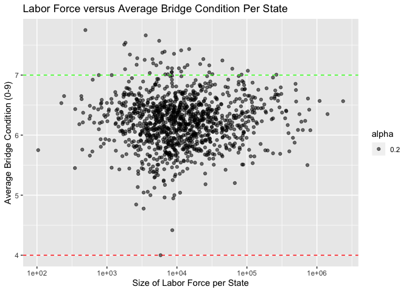
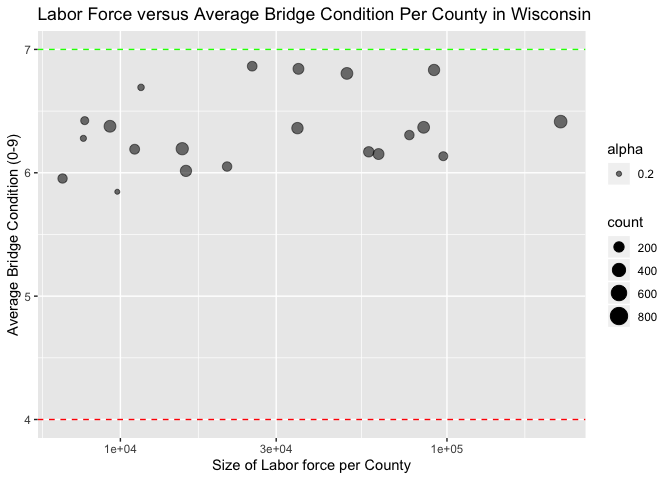

Bridges - Homework 1
====================

    # Downloading necessary packages
    library(dplyr)

    ## 
    ## Attaching package: 'dplyr'

    ## The following objects are masked from 'package:stats':
    ## 
    ##     filter, lag

    ## The following objects are masked from 'package:base':
    ## 
    ##     intersect, setdiff, setequal, union

    library(data.table)

    ## 
    ## Attaching package: 'data.table'

    ## The following objects are masked from 'package:dplyr':
    ## 
    ##     between, first, last

    library(ggplot2)
    library(tidyverse)

    ## ── Attaching packages ────────────────────────── tidyverse 1.3.0 ──

    ## ✔ tibble  2.1.3     ✔ purrr   0.3.3
    ## ✔ tidyr   1.0.0     ✔ stringr 1.4.0
    ## ✔ readr   1.3.1     ✔ forcats 0.4.0

    ## ── Conflicts ───────────────────────────── tidyverse_conflicts() ──
    ## ✖ data.table::between() masks dplyr::between()
    ## ✖ dplyr::filter()       masks stats::filter()
    ## ✖ data.table::first()   masks dplyr::first()
    ## ✖ dplyr::lag()          masks stats::lag()
    ## ✖ data.table::last()    masks dplyr::last()
    ## ✖ purrr::transpose()    masks data.table::transpose()

### Downloading the Data

After the download is complete, I run several checks to make sure it
loaded correctly.

    # Need to open the zip file
    dt <- fread("curl https://www.fhwa.dot.gov/bridge/nbi/2018hwybronefiledel.zip | funzip")

    # Comparing my table in R to the CSV file I downloaded onto to my local computer
    # head(dt) # Matches the first 6 rows of the Excel file
    # tail(dt) # Matches the last 6 rows of the Excel file
    dim(dt) # Matches the number of rows and columns that I have when I open the file in Excel

    ## [1] 616096    137

### Creating a Subset

I chose several columns that I wanted to work with

    # bridge ID, year, fips codes, condition ratings
    dt_small <- select(dt, STRUCTURE_NUMBER_008, YEAR_BUILT_027, STATE_CODE_001, COUNTY_CODE_003, CAT10, CAT23, CAT29) %>% 
      rename(bridge_id = STRUCTURE_NUMBER_008, year_built = YEAR_BUILT_027, state = STATE_CODE_001, county = COUNTY_CODE_003, bridge_cond = CAT10, overall_bridge_cond = CAT23, deck_cond = CAT29)

### Exploratory Data Analysis

In order to ask a good question, I want to know what my data contains.

    # How many bridges were built per year?
    dt_small %>% 
      group_by(year_built) %>%
      summarise(count = n()) %>% 
      ggplot() + geom_line(aes(x = year_built, y = count))

    ## Warning: Removed 1 rows containing missing values (geom_path).

    # How many bridges were built in each state?
    dt_small %>% 
      group_by(state) %>%
      summarise(count = n()) %>% 
      ggplot(aes(x = state, y = count)) + geom_bar(stat="identity")

    # What states had the most bridges built?
    dt_small %>% 
      group_by(state) %>%
      summarise(count = n()) %>% 
      filter(count >= 20000) %>%
      arrange(desc(count))

    ## # A tibble: 10 x 2
    ##    state count
    ##    <int> <int>
    ##  1    48 54131
    ##  2    39 27277
    ##  3    17 26809
    ##  4     6 25737
    ##  5    20 24906
    ##  6    29 24512
    ##  7    19 24123
    ##  8    40 23116
    ##  9    42 22737
    ## 10    47 20177

    # What values are in bridge_cond, overall_bridge_cond, and deck_cond?
    dt_small %>%
      select(bridge_cond) %>% 
      group_by(bridge_cond) %>% 
      summarise(n = n())

    ## # A tibble: 4 x 2
    ##   bridge_cond      n
    ##   <chr>        <int>
    ## 1 F           285676
    ## 2 G           283316
    ## 3 N               50
    ## 4 P            47054

    # Meanings derived from this site: https://www.fhwa.dot.gov/tpm/pubs/PM2FAQs.pdf
    # >= 7 means "Good"
    # 4 < x < 7 means "Fair"
    # <= 4 means "Poor"
    # N might mean NA? Not specified in the documentation

    dt_small %>%
      select(overall_bridge_cond) %>% 
      group_by(overall_bridge_cond) %>% 
      summarise(n = n())

    ## # A tibble: 11 x 2
    ##    overall_bridge_cond      n
    ##    <chr>                <int>
    ##  1 0                      980
    ##  2 1                      444
    ##  3 2                     1804
    ##  4 3                     8804
    ##  5 4                    35022
    ##  6 5                   109256
    ##  7 6                   176420
    ##  8 7                   210214
    ##  9 8                    62372
    ## 10 9                    10730
    ## 11 N                       50

    dt_small %>%
      select(deck_cond) %>% 
      group_by(deck_cond) %>% 
      summarise(n = n())

    ## # A tibble: 78,282 x 2
    ##    deck_cond     n
    ##        <dbl> <int>
    ##  1      1.92     1
    ##  2      2.1      1
    ##  3      3.6      1
    ##  4      3.84     1
    ##  5      4.23     1
    ##  6      4.56     1
    ##  7      5.2      2
    ##  8      6.71     1
    ##  9      7.32     1
    ## 10      7.38     1
    ## # … with 78,272 more rows

    deck_range <- dt_small %>%
      select(deck_cond) %>% 
      arrange(desc(deck_cond))
    head(deck_range) # 486680.4

    ##   deck_cond
    ## 1  486680.4
    ## 2  368847.4
    ## 3  368180.2
    ## 4  303971.2
    ## 5  300472.9
    ## 6  284739.4

    tail(deck_range) # 1.92

    ##        deck_cond
    ## 616091      4.56
    ## 616092      4.23
    ## 616093      3.84
    ## 616094      3.60
    ## 616095      2.10
    ## 616096      1.92

    # Checking if the bridge_cond grade is based on the overall_bridge_cond score.
    dt_small %>%
      select(bridge_cond, overall_bridge_cond) %>% 
      filter(bridge_cond == 'F') %>% 
      group_by(overall_bridge_cond) %>% 
      summarise(n = n())

    ## # A tibble: 2 x 2
    ##   overall_bridge_cond      n
    ##   <chr>                <int>
    ## 1 5                   109256
    ## 2 6                   176420

    dt_small %>%
      select(bridge_cond, overall_bridge_cond) %>% 
      filter(bridge_cond == 'G') %>% 
      group_by(overall_bridge_cond) %>% 
      summarise(n = n())

    ## # A tibble: 3 x 2
    ##   overall_bridge_cond      n
    ##   <chr>                <int>
    ## 1 7                   210214
    ## 2 8                    62372
    ## 3 9                    10730

    dt_small %>%
      select(bridge_cond, overall_bridge_cond) %>% 
      filter(bridge_cond == 'P') %>% 
      group_by(overall_bridge_cond) %>% 
      summarise(n = n())

    ## # A tibble: 5 x 2
    ##   overall_bridge_cond     n
    ##   <chr>               <int>
    ## 1 0                     980
    ## 2 1                     444
    ## 3 2                    1804
    ## 4 3                    8804
    ## 5 4                   35022

    # My theory holds.

### Asking the Question

Now I want to see if the more recent bridges have better condition
ratings than the older bridges. My hypothesis is that as
technology/science improve over the years, the condition ratings of the
bridges will also improve.     First, I ran into some brief
clean-up work.

    # overall_bridge_cond is a character value
    dt_small <- dt_small %>% filter(bridge_cond != 'N') # Taking this out bc it corresponds with a "N" value for overall_bridge_cond
    dt_small$overall_bridge_cond <- parse_integer(dt_small$overall_bridge_cond) # changing to an integer so I can analyze it
    str(dt_small)

    ## 'data.frame':    616046 obs. of  7 variables:
    ##  $ bridge_id          : chr  "00000000000S702" "00000000000S703" "0000000000M0022" "000000883039900" ...
    ##  $ year_built         : int  1999 2002 1942 1974 1937 1924 1898 1900 1939 1900 ...
    ##  $ state              : int  1 1 1 1 1 1 1 1 1 1 ...
    ##  $ county             : int  53 53 113 59 79 33 127 127 95 75 ...
    ##  $ bridge_cond        : chr  "G" "G" "F" "G" ...
    ##  $ overall_bridge_cond: int  7 7 5 7 5 5 4 4 7 4 ...
    ##  $ deck_cond          : num  146 133 387 688 15453 ...
    ##  - attr(*, ".internal.selfref")=<externalptr>

    dim(dt_small)

    ## [1] 616046      7

    # bridges with the same id code?
    dt_small %>% 
      select(bridge_id, year_built, overall_bridge_cond) %>% 
      group_by(bridge_id) %>% 
      summarise(n = n())

    ## # A tibble: 561,249 x 2
    ##    bridge_id           n
    ##    <chr>           <int>
    ##  1 000000000000001     1
    ##  2 000000000000002     2
    ##  3 000000000000003     2
    ##  4 000000000000004     2
    ##  5 000000000000005     2
    ##  6 000000000000007     2
    ##  7 000000000000008     2
    ##  8 000000000000009     3
    ##  9 000000000000010     3
    ## 10 000000000000011     2
    ## # … with 561,239 more rows

    dt_small %>% 
      filter(bridge_id == '000000000000010')

    ##         bridge_id year_built state county bridge_cond overall_bridge_cond
    ## 1 000000000000010       1995    26      1           G                   7
    ## 2 000000000000010       1963    42      1           F                   5
    ## 3 000000000000010       1918    44      7           F                   5
    ##   deck_cond
    ## 1    246.48
    ## 2    154.00
    ## 3    799.75

    #  In this example, there are duplicate bridge_id numbers, but they are not duplicate rows

    # Trying to remove duplicates below
    dt_small %>% 
      group_by(bridge_id, year_built, state, bridge_cond, overall_bridge_cond, deck_cond) %>% 
      summarise(n = n())

    ## # A tibble: 616,045 x 7
    ## # Groups:   bridge_id, year_built, state, bridge_cond, overall_bridge_cond
    ## #   [616,044]
    ##    bridge_id  year_built state bridge_cond overall_bridge_… deck_cond     n
    ##    <chr>           <int> <int> <chr>                  <int>     <dbl> <int>
    ##  1 000000000…       1963    42 G                          7      410.     1
    ##  2 000000000…       1934    35 F                          5      463.     1
    ##  3 000000000…       1990    42 G                          7      408.     1
    ##  4 000000000…       1963    42 F                          6      428.     1
    ##  5 000000000…       1964    51 P                          4      645.     1
    ##  6 000000000…       1900    45 P                          4     2026.     1
    ##  7 000000000…       1990    42 G                          7      590.     1
    ##  8 000000000…       1963    42 F                          5      635.     1
    ##  9 000000000…       1970    51 F                          5     2024.     1
    ## 10 000000000…       1935    26 G                          7      127.     1
    ## # … with 616,035 more rows

    # No duplicate rows. Will continue.

  Now I can get to answering my question.

    dt_small %>% 
      select(bridge_id, year_built, overall_bridge_cond) %>%
      group_by(year_built) %>% 
      summarise(avg_cond = mean(overall_bridge_cond, na.rm = TRUE)) %>% 
      ggplot(aes(x = year_built, y = avg_cond)) + 
      geom_point() + 
      geom_hline(yintercept = 7, linetype="dashed", color = "green") +
      geom_hline(yintercept = 4, linetype="dashed", color = "red") +
      ggtitle("Average Bridge Condition per Year") +
      xlab("Year Bridge Was Built") + 
      ylab("Average Overall Bridge Condition Score")

    ## Warning: Removed 1 rows containing missing values (geom_point).

    # My hypothesis is correct.

    # Let's zoom in on Wisconsin.
    dt_small %>% 
      filter(state == 55) %>% 
      select(bridge_id, year_built, overall_bridge_cond) %>%
      group_by(year_built) %>% 
      summarise(avg_cond = mean(overall_bridge_cond, na.rm = TRUE)) %>% 
      ggplot(aes(x = year_built, y = avg_cond)) + 
      geom_point() + 
      geom_hline(yintercept = 7, linetype="dashed", color = "green") +
      geom_hline(yintercept = 4, linetype="dashed", color = "red") +
      ggtitle("Average Bridge Condition per Year in Wisconsin") +
      xlab("Year Bridge Was Built") + 
      ylab("Average Overall Bridge Condition Score")

### Summarizing My Findings

After looking through all 137 columns, I chose columns that I understood
and saw value in studying. I wanted to analyze the condition of these
bridges over the years to see how their overall condition has changed.
From 1760 to 2000, average condition rating per year was categorized as
“Fair,” except for about 10 years. Since the year 2000, the average
rating has skyrocketed to an average of 8.5 in 2019 across all bridges.
This tells me the quality of bridges has steadily increased since around
1915.

Adding the BLS Unemployment Data
================================

    # https://www.r-bloggers.com/using-blscraper-to-map-county-unemployment-data/
    library(blscrapeR)
    bls <- get_bls_county()
    # head(bls)

### Plot for all states

    # Need state and county codes to be character to join on those variables
    bridge <- dt_small
    bridge$state <- as.character(bridge$state)
    bridge$county <- as.character(bridge$county)
    str(bridge)

    ## 'data.frame':    616046 obs. of  7 variables:
    ##  $ bridge_id          : chr  "00000000000S702" "00000000000S703" "0000000000M0022" "000000883039900" ...
    ##  $ year_built         : int  1999 2002 1942 1974 1937 1924 1898 1900 1939 1900 ...
    ##  $ state              : chr  "1" "1" "1" "1" ...
    ##  $ county             : chr  "53" "53" "113" "59" ...
    ##  $ bridge_cond        : chr  "G" "G" "F" "G" ...
    ##  $ overall_bridge_cond: int  7 7 5 7 5 5 4 4 7 4 ...
    ##  $ deck_cond          : num  146 133 387 688 15453 ...
    ##  - attr(*, ".internal.selfref")=<externalptr>

    # Creating a plot
    bridge %>% 
      select(bridge_id, year_built, state, county, overall_bridge_cond) %>%
      group_by(state, county) %>% 
      left_join(bls, by = c("state" = "fips_state", "county" = "fips_county")) %>% 
      group_by(state, labor_force) %>% 
      summarise(avg_cond = mean(overall_bridge_cond, na.rm = TRUE)) %>% 
      ggplot(aes(x = labor_force, y = avg_cond)) + 
      geom_point(aes(alpha = .2)) +
      xlab("Size of Labor Force per State") + 
      ylab("Average Bridge Condition (0-9)") +
      ggtitle("Labor Force versus Average Bridge Condition Per State") +
      geom_hline(yintercept = 7, linetype="dashed", color = "green") +
      geom_hline(yintercept = 4, linetype="dashed", color = "red") +
      scale_x_continuous(trans = 'log10')

    ## Warning: Removed 53 rows containing missing values (geom_point).

### Plot for Wisconsin

    bridge %>% 
      select(bridge_id, year_built, state, county, overall_bridge_cond) %>%
      group_by(state, county) %>% 
      left_join(bls, by = c("state" = "fips_state", "county" = "fips_county")) %>% 
      group_by(state, county, labor_force) %>% 
      summarise(avg_cond = mean(overall_bridge_cond, na.rm = TRUE),
                count = n()) %>% 
      filter(state == "55") %>% 
      ggplot(aes(x = labor_force, y = avg_cond)) + 
      geom_point(aes(size = count, alpha = .2)) +
      xlab("Size of Labor force per County") +
      ylab("Average Bridge Condition (0-9)") +
      ggtitle("Labor Force versus Average Bridge Condition Per County in Wisconsin") +
      geom_hline(yintercept = 7, linetype="dashed", color = "green") +
      geom_hline(yintercept = 4, linetype="dashed", color = "red") +
      scale_x_continuous(trans = 'log10')

    ## Warning: Removed 51 rows containing missing values (geom_point).

