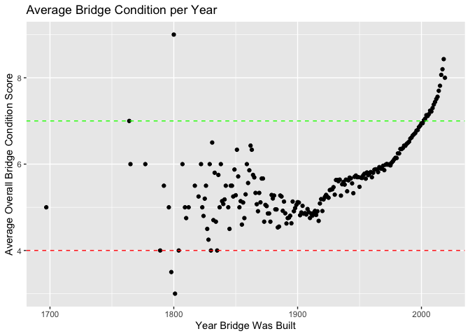

Bridges - Homework 1
====================

    # Downloading necessary packages
    library(dplyr)

    ## 
    ## Attaching package: 'dplyr'

    ## The following objects are masked from 'package:stats':
    ## 
    ##     filter, lag

    ## The following objects are masked from 'package:base':
    ## 
    ##     intersect, setdiff, setequal, union

    library(data.table)

    ## 
    ## Attaching package: 'data.table'

    ## The following objects are masked from 'package:dplyr':
    ## 
    ##     between, first, last

    library(ggplot2)
    library(tidyverse)

    ## ── Attaching packages ────────────────────────── tidyverse 1.3.0 ──

    ## ✔ tibble  2.1.3     ✔ purrr   0.3.3
    ## ✔ tidyr   1.0.0     ✔ stringr 1.4.0
    ## ✔ readr   1.3.1     ✔ forcats 0.4.0

    ## ── Conflicts ───────────────────────────── tidyverse_conflicts() ──
    ## ✖ data.table::between() masks dplyr::between()
    ## ✖ dplyr::filter()       masks stats::filter()
    ## ✖ data.table::first()   masks dplyr::first()
    ## ✖ dplyr::lag()          masks stats::lag()
    ## ✖ data.table::last()    masks dplyr::last()
    ## ✖ purrr::transpose()    masks data.table::transpose()

### Downloading the Data

After the download is complete, I run several checks to make sure it
loaded correctly.

    # Need to open the zip file
    dt <- fread("curl https://www.fhwa.dot.gov/bridge/nbi/2018hwybronefiledel.zip | funzip")

    # Comparing my table in R to the CSV file I downloaded onto to my local computer
    head(dt) # Matches the first 6 rows of the Excel file

    ##    STATE_CODE_001 STRUCTURE_NUMBER_008 RECORD_TYPE_005A ROUTE_PREFIX_005B
    ## 1:              1      00000000000S702                1                 6
    ## 2:              1      00000000000S703                1                 6
    ## 3:              1      0000000000M0022                1                 8
    ## 4:              1      000000883039900                1                 4
    ## 5:              1      000001014002450                1                 3
    ## 6:              1      000001331700710                1                 6
    ##    SERVICE_LEVEL_005C ROUTE_NUMBER_005D DIRECTION_005E
    ## 1:                  1             04007              0
    ## 2:                  1             04003              0
    ## 3:                  1             00000              0
    ## 4:                  1             00088              0
    ## 5:                  1             00101              0
    ## 6:                  2             00000              0
    ##    HIGHWAY_DISTRICT_002 COUNTY_CODE_003 PLACE_CODE_004
    ## 1:                   09              53              0
    ## 2:                   09              53           3004
    ## 3:                   00             113          27568
    ## 4:                   02              59              0
    ## 5:                   02              79              0
    ## 6:                   02              33              0
    ##            FEATURES_DESC_006A CRITICAL_FACILITY_006B FACILITY_CARRIED_007
    ## 1: '           PERDIDO CREEK'                     NA '  IRR BIA RTE 4007'
    ## 2: '           PERDIDO CREEK'                     NA '  IRR BIA RTE 4003'
    ## 3: 'UCHEE CREEK             '                     NA '101ST AIRBORNE RD '
    ## 4: 'LITTLE BEAR CR. DAM SPW '                     NA 'CO. RD 88         '
    ## 5: 'TENNESSEE RIVER         '                     NA 'SR 101            '
    ## 6: 'TENNESSEE RIVER         '                     NA 'Res Rd            '
    ##                   LOCATION_009 MIN_VERT_CLR_010 KILOPOINT_011
    ## 1: '  11.4KM NW OF ATMORE  AL'            99.99         1.500
    ## 2: '       ON LYNN MCGEE ROAD'            99.99         1.100
    ## 3: '3.4 KM S OF SUNSHINE RD  '            99.99         0.000
    ## 4: 'LITTLE BEAR CR DAM       '            99.99         0.000
    ## 5: 'ON WHEELER DAM           '             4.52        39.429
    ## 6: 'ON WILSON DAM            '            99.99         0.000
    ##    BASE_HWY_NETWORK_012 LRS_INV_ROUTE_013A SUBROUTE_NO_013B  LAT_016
    ## 1:                    0         0000000000                0 31061110
    ## 2:                    0         0000000000                0 31062020
    ## 3:                    0                                  NA 32174328
    ## 4:                    0                                  NA 34270600
    ## 5:                    0                                  NA 34481800
    ## 6:                    0                                  NA 34480000
    ##    LONG_017 DETOUR_KILOS_019 TOLL_020 MAINTENANCE_021 OWNER_022
    ## 1: 87341340                3        3              62        62
    ## 2: 87340890                3        3              62        62
    ## 3: 84583800               18        3              74        74
    ## 4: 87581200               16        3              67        67
    ## 5: 87225400               42        3              67        67
    ## 6: 87373000                6        3              67        67
    ##    FUNCTIONAL_CLASS_026 YEAR_BUILT_027 TRAFFIC_LANES_ON_028A
    ## 1:                    9           1999                     2
    ## 2:                    9           2002                     2
    ## 3:                    9           1942                     2
    ## 4:                    8           1974                     2
    ## 5:                    6           1937                     2
    ## 6:                   17           1924                     2
    ##    TRAFFIC_LANES_UND_028B ADT_029 YEAR_ADT_030 DESIGN_LOAD_031
    ## 1:                      0      50         2014               5
    ## 2:                      0     159         2017               5
    ## 3:                      0     375         2017               4
    ## 4:                      0     300         2013               5
    ## 5:                      0    6200         2014               4
    ## 6:                      2    3620         2013               3
    ##    APPR_WIDTH_MT_032 MEDIAN_CODE_033 DEGREES_SKEW_034 STRUCTURE_FLARED_035
    ## 1:               9.7               0               30                    0
    ## 2:               6.5               0                0                    0
    ## 3:              10.4               0                0                    0
    ## 4:              11.6               0               99                    0
    ## 5:               7.9               0                0                    0
    ## 6:               7.9               0                0                    0
    ##    RAILINGS_036A TRANSITIONS_036B APPR_RAIL_036C APPR_RAIL_END_036D
    ## 1:             1                1              1                  1
    ## 2:             1                1              1                  1
    ## 3:             0                0              1                  1
    ## 4:             1                1              1                  1
    ## 5:             1                0              0                  0
    ## 6:             1                0              0                  0
    ##    HISTORY_037 NAVIGATION_038 NAV_VERT_CLR_MT_039 NAV_HORR_CLR_MT_040
    ## 1:           5              0                 0.0                 0.0
    ## 2:           5              0                 0.0                 0.0
    ## 3:           5              0                 0.0                 0.0
    ## 4:           5              N                 0.0                 0.0
    ## 5:           4              1                17.9                33.5
    ## 6:           1              1                17.3                33.5
    ##    OPEN_CLOSED_POSTED_041 SERVICE_ON_042A SERVICE_UND_042B
    ## 1:                      A               1                5
    ## 2:                      A               1                5
    ## 3:                      A               1                5
    ## 4:                      A               1                9
    ## 5:                      A               5                5
    ## 6:                      A               5                6
    ##    STRUCTURE_KIND_043A STRUCTURE_TYPE_043B APPR_KIND_044A APPR_TYPE_044B
    ## 1:                   5                   5              0              0
    ## 2:                   5                   1              0              0
    ## 3:                   1                   4              0              0
    ## 4:                   5                   5              0              0
    ## 5:                   3                  10              3              2
    ## 6:                   4                   3              1             20
    ##    MAIN_UNIT_SPANS_045 APPR_SPANS_046 HORR_CLR_MT_047 MAX_SPAN_LEN_MT_048
    ## 1:                   1              0             9.7                14.7
    ## 2:                   1              0             9.7                12.9
    ## 3:                   3              0             7.2                18.3
    ## 4:                   5              0             8.6                14.0
    ## 5:                   2            143             6.0                53.3
    ## 6:                   8             78             6.0                46.9
    ##    STRUCTURE_LEN_MT_049 LEFT_CURB_MT_050A RIGHT_CURB_MT_050B
    ## 1:                 15.0               0.0                0.0
    ## 2:                 13.6               0.3                0.3
    ## 3:                 43.0               0.6                0.6
    ## 4:                 65.5               0.0                0.0
    ## 5:               1981.2               0.9                0.2
    ## 6:               1512.4               1.7                0.5
    ##    ROADWAY_WIDTH_MT_051 DECK_WIDTH_MT_052 VERT_CLR_OVER_MT_053
    ## 1:                  9.7               9.7                99.99
    ## 2:                  9.1               9.8                99.99
    ## 3:                  7.2               9.0                99.99
    ## 4:                  8.7              10.5                99.99
    ## 5:                  6.1               7.8                 4.52
    ## 6:                  6.1               8.3                99.99
    ##    VERT_CLR_UND_REF_054A VERT_CLR_UND_054B LAT_UND_REF_055A
    ## 1:                     N              0.00                N
    ## 2:                     N              0.00                N
    ## 3:                     N              0.00                N
    ## 4:                     N              0.00                N
    ## 5:                     N              0.00                N
    ## 6:                     H             12.19                H
    ##    LAT_UND_MT_055B LEFT_LAT_UND_MT_056 DECK_COND_058
    ## 1:               0                   0             8
    ## 2:               0                   0             8
    ## 3:               0                   0             5
    ## 4:               0                   0             7
    ## 5:               0                   0             5
    ## 6:               6                   0             5
    ##    SUPERSTRUCTURE_COND_059 SUBSTRUCTURE_COND_060 CHANNEL_COND_061
    ## 1:                       8                     7                8
    ## 2:                       8                     7                7
    ## 3:                       5                     6                6
    ## 4:                       7                     7                7
    ## 5:                       6                     5                9
    ## 6:                       5                     5                8
    ##    CULVERT_COND_062 OPR_RATING_METH_063 OPERATING_RATING_064
    ## 1:                N                   2                 44.2
    ## 2:                N                   2                 84.2
    ## 3:                N                   2                 51.7
    ## 4:                N                   1                 44.2
    ## 5:                N                   1                 40.0
    ## 6:                N                   1                 58.4
    ##    INV_RATING_METH_065 INVENTORY_RATING_066 STRUCTURAL_EVAL_067
    ## 1:                   2                 32.4                   7
    ## 2:                   2                 34.8                   7
    ## 3:                   2                 37.2                   5
    ## 4:                   1                 26.6                   6
    ## 5:                   1                 23.9                   5
    ## 6:                   1                 35.0                   5
    ##    DECK_GEOMETRY_EVAL_068 UNDCLRENCE_EVAL_069 POSTING_EVAL_070
    ## 1:                      7                   N                5
    ## 2:                      6                   N                5
    ## 3:                      4                   N                5
    ## 4:                      6                   N                5
    ## 5:                      2                   N                5
    ## 6:                      2                   9                5
    ##    WATERWAY_EVAL_071 APPR_ROAD_EVAL_072 WORK_PROPOSED_075A
    ## 1:                 8                  8                 NA
    ## 2:                 7                  8                 NA
    ## 3:                 8                  6                 38
    ## 4:                 9                  6                 NA
    ## 5:                 8                  8                 31
    ## 6:                 9                  3                 31
    ##    WORK_DONE_BY_075B IMP_LEN_MT_076 DATE_OF_INSPECT_090
    ## 1:                NA            0.0                 117
    ## 2:                NA            0.0                 117
    ## 3:                 1           52.8                1017
    ## 4:                NA             NA                 616
    ## 5:                 1         1981.2                 517
    ## 6:                 1         1512.4                 616
    ##    INSPECT_FREQ_MONTHS_091 FRACTURE_092A UNDWATER_LOOK_SEE_092B
    ## 1:                      24             N                      N
    ## 2:                      24             N                      N
    ## 3:                      24             N                    Y60
    ## 4:                      24             N                      N
    ## 5:                      24           Y24                      N
    ## 6:                      24           Y24                      N
    ##    SPEC_INSPECT_092C FRACTURE_LAST_DATE_093A UNDWATER_LAST_DATE_093B
    ## 1:                 N                      NA                      NA
    ## 2:                 N                      NA                      NA
    ## 3:                 N                      NA                    1017
    ## 4:                 N                      NA                      NA
    ## 5:                 N                     517                      NA
    ## 6:                 N                     616                      NA
    ##    SPEC_LAST_DATE_093C BRIDGE_IMP_COST_094 ROADWAY_IMP_COST_095
    ## 1:                  NA                   0                    0
    ## 2:                  NA                   0                    0
    ## 3:                  NA                   1                    1
    ## 4:                  NA                  NA                   NA
    ## 5:                  NA               50000                 2000
    ## 6:                  NA               35000                 2000
    ##    TOTAL_IMP_COST_096 YEAR_OF_IMP_097 OTHER_STATE_CODE_098A
    ## 1:                  0            2017                      
    ## 2:                  0            2017                      
    ## 3:                  2            2017                      
    ## 4:                 NA              NA                      
    ## 5:              60000            2010                      
    ## 6:              45000            2010                      
    ##    OTHER_STATE_PCNT_098B OTHR_STATE_STRUC_NO_099 STRAHNET_HIGHWAY_100
    ## 1:                     0                                            0
    ## 2:                     0                                            0
    ## 3:                    NA                                            0
    ## 4:                    NA                                            0
    ## 5:                    NA                                            0
    ## 6:                    NA                                            0
    ##    PARALLEL_STRUCTURE_101 TRAFFIC_DIRECTION_102 TEMP_STRUCTURE_103
    ## 1:                      N                     2                   
    ## 2:                      N                     2                   
    ## 3:                      N                     2                   
    ## 4:                      N                     2                   
    ## 5:                      N                     2                   
    ## 6:                      N                     2                   
    ##    HIGHWAY_SYSTEM_104 FEDERAL_LANDS_105 YEAR_RECONSTRUCTED_106
    ## 1:                  0                 1                      0
    ## 2:                  0                 1                      0
    ## 3:                  0                 0                      0
    ## 4:                  0                 0                      0
    ## 5:                  0                 0                   1962
    ## 6:                  0                 0                   1958
    ##    DECK_STRUCTURE_TYPE_107 SURFACE_TYPE_108A MEMBRANE_TYPE_108B
    ## 1:                       2                 6                  0
    ## 2:                       2                 6                  0
    ## 3:                       1                 1                  0
    ## 4:                       1                 0                  0
    ## 5:                       1                 0                  0
    ## 6:                       1                 5                  0
    ##    DECK_PROTECTION_108C PERCENT_ADT_TRUCK_109 NATIONAL_NETWORK_110
    ## 1:                    1                     1                    0
    ## 2:                    8                     1                    0
    ## 3:                    0                    35                    0
    ## 4:                    0                     5                    0
    ## 5:                    0                    10                    0
    ## 6:                    0                     8                    0
    ##    PIER_PROTECTION_111 BRIDGE_LEN_IND_112 SCOUR_CRITICAL_113
    ## 1:                  NA                  Y                  8
    ## 2:                  NA                  Y                  8
    ## 3:                  NA                  Y                  8
    ## 4:                  NA                  Y                  5
    ## 5:                   1                  Y                  5
    ## 6:                   1                  Y                  5
    ##    FUTURE_ADT_114 YEAR_OF_FUTURE_ADT_115 MIN_NAV_CLR_MT_116 FED_AGENCY
    ## 1:             59                   2037                  0          Y
    ## 2:            200                   2034                  0          Y
    ## 3:            400                   2039                 NA          Y
    ## 4:            350                   2032                 NA          Y
    ## 5:          10000                   2030                 NA          Y
    ## 6:           2500                   2030                 NA          Y
    ##    DATE_LAST_UPDATE TYPE_LAST_UPDATE DEDUCT_CODE REMARKS PROGRAM_CODE
    ## 1:        6/13/2018                B           Z      NA             
    ## 2:        6/13/2018                B           Z      NA             
    ## 3:         6/4/2018                B           Z      NA             
    ## 4:        5/23/2018                B           Z      NA             
    ## 5:        5/23/2018                B           C      NA             
    ## 6:        5/23/2018                B           A      NA             
    ##    PROJ_NO PROJ_SUFFIX NBI_TYPE_OF_IMP DTL_TYPE_OF_IMP SPECIAL_CODE
    ## 1:                  NA              NA              NA           NA
    ## 2:                  NA              NA              NA           NA
    ## 3:                  NA              NA              NA           NA
    ## 4:                  NA              NA              NA           NA
    ## 5:                  NA              NA              NA           NA
    ## 6:                  NA              NA              NA           NA
    ##    STEP_CODE STATUS_WITH_10YR_RULE SUFFICIENCY_ASTERC SUFFICIENCY_RATING
    ## 1:        NA                     0                                 100.0
    ## 2:        NA                     0                                 100.0
    ## 3:        NA                     0                                  69.5
    ## 4:        NA                     0                                  90.2
    ## 5:        NA                     2                                  45.9
    ## 6:        NA                     2                                  61.3
    ##    STATUS_NO_10YR_RULE CAT10 CAT23    CAT29
    ## 1:                   0     G     7   145.50
    ## 2:                   0     G     7   133.28
    ## 3:                   0     F     5   387.00
    ## 4:                   0     G     7   687.75
    ## 5:                   2     F     5 15453.36
    ## 6:                   2     F     5 12552.92

    tail(dt) # Matches the last 6 rows of the Excel file

    ##    STATE_CODE_001 STRUCTURE_NUMBER_008 RECORD_TYPE_005A ROUTE_PREFIX_005B
    ## 1:             72      000041528-TMP26                1                 6
    ## 2:             72      DAPASOBUC000157                1                 8
    ## 3:             72      DAPASOBUC000542                1                 8
    ## 4:             72      DAPASOBUC000602                1                 8
    ## 5:             72      DAPASOBUC000603                1                 8
    ## 6:             72      DAPASOBUC00C009                1                 8
    ##    SERVICE_LEVEL_005C ROUTE_NUMBER_005D DIRECTION_005E
    ## 1:                  1             00000              0
    ## 2:                  0             00000              0
    ## 3:                  0             00000              0
    ## 4:                  0             00000              0
    ## 5:                  0             00000              0
    ## 6:                  0             00000              0
    ##    HIGHWAY_DISTRICT_002 COUNTY_CODE_003 PLACE_CODE_004
    ## 1:                   04             147              0
    ## 2:                   00              61           6593
    ## 3:                   00              61           6593
    ## 4:                   00              61           6593
    ## 5:                   00              61           6593
    ## 6:                   00              61           6593
    ##            FEATURES_DESC_006A CRITICAL_FACILITY_006B FACILITY_CARRIED_007
    ## 1: 'UNNAMED DRAINAGE        '                     NA 'Rt 109            '
    ## 2: 'EL TORO CREEK           '                     NA 'CHRISMAN RD.      '
    ## 3: 'EL TORO CREEK           '                     NA 'COLUMBUS ST.      '
    ## 4: 'EL TORO CREEK           '                     NA 'SOUTH TERMINAL RD '
    ## 5: 'EL TORO CREEK           '                     NA 'PERIMETER RD.     '
    ## 6: 'EL TORO CREEK           '                     NA 'PERIMETER RD.     '
    ##                   LOCATION_009 MIN_VERT_CLR_010 KILOPOINT_011
    ## 1: 'VIEQUES NWR              '            99.99             0
    ## 2: 'NEAR BLDG 1322           '            99.99             0
    ## 3: 'NEAR BLDG 539            '            99.99             0
    ## 4: 'N OF COLUMBUS STREET     '            99.99             0
    ## 5: 'NEAR BLDG 539            '            99.99             0
    ## 6: 'SE OF HWY 28             '            99.99             0
    ##    BASE_HWY_NETWORK_012 LRS_INV_ROUTE_013A SUBROUTE_NO_013B  LAT_016
    ## 1:                    0                                  NA 18052460
    ## 2:                    0                                  NA 18244378
    ## 3:                    0                                  NA 18245976
    ## 4:                    0                                  NA 18250041
    ## 5:                    0                                  NA 18250131
    ## 6:                    0                                  NA 18250840
    ##    LONG_017 DETOUR_KILOS_019 TOLL_020 MAINTENANCE_021 OWNER_022
    ## 1: 65304620              199        3              63        63
    ## 2: 66070613                2        3              74        74
    ## 3: 66073853                2        3              74        74
    ## 4: 66072960                2        3              74        74
    ## 5: 66073443                6        3              74        74
    ## 6: 66074087                6        3              74        74
    ##    FUNCTIONAL_CLASS_026 YEAR_BUILT_027 TRAFFIC_LANES_ON_028A
    ## 1:                    9           2009                     1
    ## 2:                    9           1940                     2
    ## 3:                    9           1983                     2
    ## 4:                    9           1943                     2
    ## 5:                    9           1941                     2
    ## 6:                    9           1987                     1
    ##    TRAFFIC_LANES_UND_028B ADT_029 YEAR_ADT_030 DESIGN_LOAD_031
    ## 1:                      0       1         2017               0
    ## 2:                      0    1920         2015               0
    ## 3:                      0    3000         2015               0
    ## 4:                      0    4000         2015               0
    ## 5:                      0      50         2015               0
    ## 6:                      0      10         2015               5
    ##    APPR_WIDTH_MT_032 MEDIAN_CODE_033 DEGREES_SKEW_034 STRUCTURE_FLARED_035
    ## 1:               3.7               0                0                    0
    ## 2:               8.2               0                0                    0
    ## 3:               6.9               0                0                    0
    ## 4:               6.9               0                0                    0
    ## 5:               6.2               0                0                    0
    ## 6:               3.6               0               23                    0
    ##    RAILINGS_036A TRANSITIONS_036B APPR_RAIL_036C APPR_RAIL_END_036D
    ## 1:             1                1              1                  1
    ## 2:             1                N              N                  N
    ## 3:             1                N              1                  1
    ## 4:             1                N              N                  N
    ## 5:             N                N              N                  N
    ## 6:             N                N              N                  N
    ##    HISTORY_037 NAVIGATION_038 NAV_VERT_CLR_MT_039 NAV_HORR_CLR_MT_040
    ## 1:           5              0                   0                   0
    ## 2:           5              0                   0                   0
    ## 3:           5              0                   0                   0
    ## 4:           5              0                   0                   0
    ## 5:           5              0                   0                   0
    ## 6:           5              0                   0                   0
    ##    OPEN_CLOSED_POSTED_041 SERVICE_ON_042A SERVICE_UND_042B
    ## 1:                      A               1                5
    ## 2:                      A               1                5
    ## 3:                      A               1                5
    ## 4:                      A               1                5
    ## 5:                      A               1                5
    ## 6:                      A               1                5
    ##    STRUCTURE_KIND_043A STRUCTURE_TYPE_043B APPR_KIND_044A APPR_TYPE_044B
    ## 1:                   1                  19              0              0
    ## 2:                   1                   1              0              0
    ## 3:                   1                  19              0              0
    ## 4:                   1                   1              0              0
    ## 5:                   1                   1              0              0
    ## 6:                   1                  19              0              0
    ##    MAIN_UNIT_SPANS_045 APPR_SPANS_046 HORR_CLR_MT_047 MAX_SPAN_LEN_MT_048
    ## 1:                   3              0             4.5                 3.7
    ## 2:                   1              0             8.2                 6.1
    ## 3:                   3              0             9.9                 2.2
    ## 4:                   1              0             7.9                 6.1
    ## 5:                   1              0            12.5                 6.1
    ## 6:                   2              0             3.6                 3.5
    ##    STRUCTURE_LEN_MT_049 LEFT_CURB_MT_050A RIGHT_CURB_MT_050B
    ## 1:                 12.2               0.0                0.0
    ## 2:                  6.4               1.8                1.8
    ## 3:                  6.9               0.0                1.5
    ## 4:                 18.4               0.0                0.0
    ## 5:                 18.4               0.0                0.0
    ## 6:                  7.6               0.3                0.3
    ##    ROADWAY_WIDTH_MT_051 DECK_WIDTH_MT_052 VERT_CLR_OVER_MT_053
    ## 1:                  4.5               8.4                30.18
    ## 2:                  8.2              11.2                99.99
    ## 3:                  0.0               0.0                99.99
    ## 4:                  7.9              11.0                99.99
    ## 5:                 12.5              13.2                99.99
    ## 6:                  0.0               0.0                99.99
    ##    VERT_CLR_UND_REF_054A VERT_CLR_UND_054B LAT_UND_REF_055A
    ## 1:                     N                 0                N
    ## 2:                     N                 0                N
    ## 3:                     N                 0                N
    ## 4:                     N                 0                N
    ## 5:                     N                 0                N
    ## 6:                     N                 0                N
    ##    LAT_UND_MT_055B LEFT_LAT_UND_MT_056 DECK_COND_058
    ## 1:               0                   0             N
    ## 2:               0                   0             8
    ## 3:               0                   0             N
    ## 4:               0                   0             7
    ## 5:               0                   0             7
    ## 6:               0                   0             N
    ##    SUPERSTRUCTURE_COND_059 SUBSTRUCTURE_COND_060 CHANNEL_COND_061
    ## 1:                       N                     N                6
    ## 2:                       7                     7                7
    ## 3:                       N                     N                6
    ## 4:                       7                     7                6
    ## 5:                       7                     7                4
    ## 6:                       N                     N                6
    ##    CULVERT_COND_062 OPR_RATING_METH_063 OPERATING_RATING_064
    ## 1:                7                   2                 49.9
    ## 2:                N                   5                   NA
    ## 3:                7                   5                   NA
    ## 4:                N                   5                   NA
    ## 5:                N                   5                   NA
    ## 6:                6                   1                 29.8
    ##    INV_RATING_METH_065 INVENTORY_RATING_066 STRUCTURAL_EVAL_067
    ## 1:                   2                 23.6                   6
    ## 2:                   5                   NA                   *
    ## 3:                   5                   NA                   *
    ## 4:                   5                   NA                   *
    ## 5:                   5                   NA                   *
    ## 6:                   1                 17.8                   5
    ##    DECK_GEOMETRY_EVAL_068 UNDCLRENCE_EVAL_069 POSTING_EVAL_070
    ## 1:                      6                   N                5
    ## 2:                      4                   N                5
    ## 3:                      N                   N                5
    ## 4:                      3                   N                5
    ## 5:                      9                   N                5
    ## 6:                      N                   N                5
    ##    WATERWAY_EVAL_071 APPR_ROAD_EVAL_072 WORK_PROPOSED_075A
    ## 1:                 7                  7                 NA
    ## 2:                 7                  8                 38
    ## 3:                 7                  6                 38
    ## 4:                 7                  8                 38
    ## 5:                 7                  6                 38
    ## 6:                 6                  6                 38
    ##    WORK_DONE_BY_075B IMP_LEN_MT_076 DATE_OF_INSPECT_090
    ## 1:                NA             NA                 517
    ## 2:                 1           12.6                 317
    ## 3:                 1           13.2                 317
    ## 4:                 1           25.6                 317
    ## 5:                 1           25.6                 317
    ## 6:                 1           14.1                 317
    ##    INSPECT_FREQ_MONTHS_091 FRACTURE_092A UNDWATER_LOOK_SEE_092B
    ## 1:                      24             N                      N
    ## 2:                      24             N                      N
    ## 3:                      24             N                      N
    ## 4:                      24             N                      N
    ## 5:                      24             N                      N
    ## 6:                      24             N                      N
    ##    SPEC_INSPECT_092C FRACTURE_LAST_DATE_093A UNDWATER_LAST_DATE_093B
    ## 1:                 N                      NA                      NA
    ## 2:                 N                      NA                      NA
    ## 3:                 N                      NA                      NA
    ## 4:                 N                      NA                      NA
    ## 5:                 N                      NA                      NA
    ## 6:                 N                      NA                      NA
    ##    SPEC_LAST_DATE_093C BRIDGE_IMP_COST_094 ROADWAY_IMP_COST_095
    ## 1:                  NA                  NA                   NA
    ## 2:                  NA                   1                    1
    ## 3:                  NA                   1                    1
    ## 4:                  NA                   1                    1
    ## 5:                  NA                   1                    1
    ## 6:                  NA                   1                    1
    ##    TOTAL_IMP_COST_096 YEAR_OF_IMP_097 OTHER_STATE_CODE_098A
    ## 1:                 NA              NA                      
    ## 2:                  2            2017                      
    ## 3:                  2            2017                      
    ## 4:                  2            2017                      
    ## 5:                  2            2017                      
    ## 6:                  2            2017                      
    ##    OTHER_STATE_PCNT_098B OTHR_STATE_STRUC_NO_099 STRAHNET_HIGHWAY_100
    ## 1:                    NA                                            0
    ## 2:                    NA                                            0
    ## 3:                    NA                                            0
    ## 4:                    NA                                            0
    ## 5:                    NA                                            0
    ## 6:                    NA                                            0
    ##    PARALLEL_STRUCTURE_101 TRAFFIC_DIRECTION_102 TEMP_STRUCTURE_103
    ## 1:                      N                     3                   
    ## 2:                      N                     2                   
    ## 3:                      N                     2                   
    ## 4:                      N                     2                   
    ## 5:                      N                     2                   
    ## 6:                      N                     3                   
    ##    HIGHWAY_SYSTEM_104 FEDERAL_LANDS_105 YEAR_RECONSTRUCTED_106
    ## 1:                  0                 0                      0
    ## 2:                  0                 0                   2015
    ## 3:                  0                 0                      0
    ## 4:                  0                 0                      0
    ## 5:                  0                 0                      0
    ## 6:                  0                 0                      0
    ##    DECK_STRUCTURE_TYPE_107 SURFACE_TYPE_108A MEMBRANE_TYPE_108B
    ## 1:                       N                 N                  N
    ## 2:                       1                 6                  8
    ## 3:                       N                 N                  N
    ## 4:                       1                 6                  8
    ## 5:                       1                 6                  8
    ## 6:                       N                 N                  N
    ##    DECK_PROTECTION_108C PERCENT_ADT_TRUCK_109 NATIONAL_NETWORK_110
    ## 1:                    N                     4                    0
    ## 2:                    8                    40                    0
    ## 3:                    N                    40                    0
    ## 4:                    8                    40                    0
    ## 5:                    8                    20                    0
    ## 6:                    N                     0                    0
    ##    PIER_PROTECTION_111 BRIDGE_LEN_IND_112 SCOUR_CRITICAL_113
    ## 1:                  NA                  Y                  8
    ## 2:                   1                  Y                  8
    ## 3:                   1                  Y                  8
    ## 4:                   1                  Y                  8
    ## 5:                   1                  Y                  8
    ## 6:                   1                  Y                  8
    ##    FUTURE_ADT_114 YEAR_OF_FUTURE_ADT_115 MIN_NAV_CLR_MT_116 FED_AGENCY
    ## 1:              1                   2037                 NA          Y
    ## 2:           2000                   2037                 NA          Y
    ## 3:           3100                   2037                 NA          Y
    ## 4:           4100                   2037                 NA          Y
    ## 5:             60                   2037                 NA          Y
    ## 6:             11                   2037                 NA          Y
    ##    DATE_LAST_UPDATE TYPE_LAST_UPDATE DEDUCT_CODE REMARKS PROGRAM_CODE
    ## 1:        5/16/2018                B           Z      NA             
    ## 2:         6/4/2018                B           Z      NA             
    ## 3:         6/4/2018                B           Z      NA             
    ## 4:         6/4/2018                B           A      NA             
    ## 5:         6/4/2018                B           Z      NA             
    ## 6:         6/4/2018                B           Z      NA             
    ##    PROJ_NO PROJ_SUFFIX NBI_TYPE_OF_IMP DTL_TYPE_OF_IMP SPECIAL_CODE
    ## 1:                  NA              NA              NA           NA
    ## 2:                  NA              NA              NA           NA
    ## 3:                  NA              NA              NA           NA
    ## 4:                  NA              NA              NA           NA
    ## 5:                  NA              NA              NA           NA
    ## 6:                  NA              NA              NA           NA
    ##    STEP_CODE STATUS_WITH_10YR_RULE SUFFICIENCY_ASTERC SUFFICIENCY_RATING
    ## 1:        NA                     0                                  74.0
    ## 2:        NA                     0                  *               87.8
    ## 3:        NA                     0                  *               99.7
    ## 4:        NA                     2                  *               80.5
    ## 5:        NA                     0                  *              100.0
    ## 6:        NA                     0                  *               80.9
    ##    STATUS_NO_10YR_RULE CAT10 CAT23  CAT29
    ## 1:                   0     G     7 102.48
    ## 2:                   0     G     7  71.68
    ## 3:                   0     G     7  47.61
    ## 4:                   2     G     7 202.40
    ## 5:                   0     G     7 242.88
    ## 6:                   0     F     6  27.36

    dim(dt) # Matches the number of rows and columns that I have when I open the file in Excel

    ## [1] 616096    137

    str(dt$CAT23)

    ##  chr [1:616096] "7" "7" "5" "7" "5" "5" "4" "4" "7" "4" "6" "7" "6" ...

### Creating a Subset

I chose several columns that I wanted to work with

    # bridge ID, year, fips codes, condition ratings
    dt_small <- select(dt, STRUCTURE_NUMBER_008, YEAR_BUILT_027, STATE_CODE_001, COUNTY_CODE_003, CAT10, CAT23, CAT29) %>% 
      rename(bridge_id = STRUCTURE_NUMBER_008, year_built = YEAR_BUILT_027, state = STATE_CODE_001, county = COUNTY_CODE_003, bridge_cond = CAT10, overall_bridge_cond = CAT23, deck_cond = CAT29)

    str(dt_small)

    ## Classes 'data.table' and 'data.frame':   616096 obs. of  7 variables:
    ##  $ bridge_id          : chr  "00000000000S702" "00000000000S703" "0000000000M0022" "000000883039900" ...
    ##  $ year_built         : int  1999 2002 1942 1974 1937 1924 1898 1900 1939 1900 ...
    ##  $ state              : int  1 1 1 1 1 1 1 1 1 1 ...
    ##  $ county             : int  53 53 113 59 79 33 127 127 95 75 ...
    ##  $ bridge_cond        : chr  "G" "G" "F" "G" ...
    ##  $ overall_bridge_cond: chr  "7" "7" "5" "7" ...
    ##  $ deck_cond          : num  146 133 387 688 15453 ...
    ##  - attr(*, ".internal.selfref")=<externalptr>

    head(dt_small)

    ##          bridge_id year_built state county bridge_cond overall_bridge_cond
    ## 1: 00000000000S702       1999     1     53           G                   7
    ## 2: 00000000000S703       2002     1     53           G                   7
    ## 3: 0000000000M0022       1942     1    113           F                   5
    ## 4: 000000883039900       1974     1     59           G                   7
    ## 5: 000001014002450       1937     1     79           F                   5
    ## 6: 000001331700710       1924     1     33           F                   5
    ##    deck_cond
    ## 1:    145.50
    ## 2:    133.28
    ## 3:    387.00
    ## 4:    687.75
    ## 5:  15453.36
    ## 6:  12552.92

### Exploratory Data Analysis

In order to ask a good question, I want to know what my data contains.

    # How many bridges were built per year?
    dt_small %>% 
      group_by(year_built) %>%
      summarise(count = n()) %>% 
      ggplot() + geom_line(aes(x = year_built, y = count))

    ## Warning: Removed 1 rows containing missing values (geom_path).

    # How many bridges were built in each state?
    dt_small %>% 
      group_by(state) %>%
      summarise(count = n()) %>% 
      ggplot(aes(x = state, y = count)) + geom_bar(stat="identity")

    # What states had the most bridges built?
    dt_small %>% 
      group_by(state) %>%
      summarise(count = n()) %>% 
      filter(count >= 20000) %>%
      arrange(desc(count))

    ## # A tibble: 10 x 2
    ##    state count
    ##    <int> <int>
    ##  1    48 54131
    ##  2    39 27277
    ##  3    17 26809
    ##  4     6 25737
    ##  5    20 24906
    ##  6    29 24512
    ##  7    19 24123
    ##  8    40 23116
    ##  9    42 22737
    ## 10    47 20177

    # What values are in bridge_cond, overall_bridge_cond, and deck_cond?
    dt_small %>%
      select(bridge_cond) %>% 
      group_by(bridge_cond) %>% 
      summarise(n = n())

    ## # A tibble: 4 x 2
    ##   bridge_cond      n
    ##   <chr>        <int>
    ## 1 F           285676
    ## 2 G           283316
    ## 3 N               50
    ## 4 P            47054

    # Meanings derived from this site: https://www.fhwa.dot.gov/tpm/pubs/PM2FAQs.pdf
    # >= 7 means "Good"
    # 4 < x < 7 means "Fair"
    # <= 4 means "Poor"
    # N might mean NA? Not specified in the documentation

    dt_small %>%
      select(overall_bridge_cond) %>% 
      group_by(overall_bridge_cond) %>% 
      summarise(n = n())

    ## # A tibble: 11 x 2
    ##    overall_bridge_cond      n
    ##    <chr>                <int>
    ##  1 0                      980
    ##  2 1                      444
    ##  3 2                     1804
    ##  4 3                     8804
    ##  5 4                    35022
    ##  6 5                   109256
    ##  7 6                   176420
    ##  8 7                   210214
    ##  9 8                    62372
    ## 10 9                    10730
    ## 11 N                       50

    dt_small %>%
      select(deck_cond) %>% 
      group_by(deck_cond) %>% 
      summarise(n = n())

    ## # A tibble: 78,282 x 2
    ##    deck_cond     n
    ##        <dbl> <int>
    ##  1      1.92     1
    ##  2      2.1      1
    ##  3      3.6      1
    ##  4      3.84     1
    ##  5      4.23     1
    ##  6      4.56     1
    ##  7      5.2      2
    ##  8      6.71     1
    ##  9      7.32     1
    ## 10      7.38     1
    ## # … with 78,272 more rows

    deck_range <- dt_small %>%
      select(deck_cond) %>% 
      arrange(desc(deck_cond))
    head(deck_range) # 486680.4

    ##   deck_cond
    ## 1  486680.4
    ## 2  368847.4
    ## 3  368180.2
    ## 4  303971.2
    ## 5  300472.9
    ## 6  284739.4

    tail(deck_range) # 1.92

    ##        deck_cond
    ## 616091      4.56
    ## 616092      4.23
    ## 616093      3.84
    ## 616094      3.60
    ## 616095      2.10
    ## 616096      1.92

    # Checking if the bridge_cond grade is based on the overall_bridge_cond score.
    dt_small %>%
      select(bridge_cond, overall_bridge_cond) %>% 
      filter(bridge_cond == 'F') %>% 
      group_by(overall_bridge_cond) %>% 
      summarise(n = n())

    ## # A tibble: 2 x 2
    ##   overall_bridge_cond      n
    ##   <chr>                <int>
    ## 1 5                   109256
    ## 2 6                   176420

    dt_small %>%
      select(bridge_cond, overall_bridge_cond) %>% 
      filter(bridge_cond == 'G') %>% 
      group_by(overall_bridge_cond) %>% 
      summarise(n = n())

    ## # A tibble: 3 x 2
    ##   overall_bridge_cond      n
    ##   <chr>                <int>
    ## 1 7                   210214
    ## 2 8                    62372
    ## 3 9                    10730

    dt_small %>%
      select(bridge_cond, overall_bridge_cond) %>% 
      filter(bridge_cond == 'P') %>% 
      group_by(overall_bridge_cond) %>% 
      summarise(n = n())

    ## # A tibble: 5 x 2
    ##   overall_bridge_cond     n
    ##   <chr>               <int>
    ## 1 0                     980
    ## 2 1                     444
    ## 3 2                    1804
    ## 4 3                    8804
    ## 5 4                   35022

    # My theory holds.

### Asking the Question

Now I want to see if the more recent bridges have better condition
ratings than the older bridges. My hypothesis is that as
technology/science improve over the years, the condition ratings of the
bridges will also improve.     First, I ran into some brief
clean-up work.

    # overall_bridge_cond is a character value
    str(dt_small) 

    ## Classes 'data.table' and 'data.frame':   616096 obs. of  7 variables:
    ##  $ bridge_id          : chr  "00000000000S702" "00000000000S703" "0000000000M0022" "000000883039900" ...
    ##  $ year_built         : int  1999 2002 1942 1974 1937 1924 1898 1900 1939 1900 ...
    ##  $ state              : int  1 1 1 1 1 1 1 1 1 1 ...
    ##  $ county             : int  53 53 113 59 79 33 127 127 95 75 ...
    ##  $ bridge_cond        : chr  "G" "G" "F" "G" ...
    ##  $ overall_bridge_cond: chr  "7" "7" "5" "7" ...
    ##  $ deck_cond          : num  146 133 387 688 15453 ...
    ##  - attr(*, ".internal.selfref")=<externalptr>

    dt_small <- dt_small %>% filter(bridge_cond != 'N') # Taking this out bc it corresponds with a "N" value for overall_bridge_cond
    dt_small$overall_bridge_cond <- parse_integer(dt_small$overall_bridge_cond) # changing to an integer so I can analyze it
    str(dt_small)

    ## 'data.frame':    616046 obs. of  7 variables:
    ##  $ bridge_id          : chr  "00000000000S702" "00000000000S703" "0000000000M0022" "000000883039900" ...
    ##  $ year_built         : int  1999 2002 1942 1974 1937 1924 1898 1900 1939 1900 ...
    ##  $ state              : int  1 1 1 1 1 1 1 1 1 1 ...
    ##  $ county             : int  53 53 113 59 79 33 127 127 95 75 ...
    ##  $ bridge_cond        : chr  "G" "G" "F" "G" ...
    ##  $ overall_bridge_cond: int  7 7 5 7 5 5 4 4 7 4 ...
    ##  $ deck_cond          : num  146 133 387 688 15453 ...
    ##  - attr(*, ".internal.selfref")=<externalptr>

    dim(dt_small)

    ## [1] 616046      7

    # bridges with the same id code?
    dt_small %>% 
      select(bridge_id, year_built, overall_bridge_cond) %>% 
      group_by(bridge_id) %>% 
      summarise(n = n())

    ## # A tibble: 561,249 x 2
    ##    bridge_id           n
    ##    <chr>           <int>
    ##  1 000000000000001     1
    ##  2 000000000000002     2
    ##  3 000000000000003     2
    ##  4 000000000000004     2
    ##  5 000000000000005     2
    ##  6 000000000000007     2
    ##  7 000000000000008     2
    ##  8 000000000000009     3
    ##  9 000000000000010     3
    ## 10 000000000000011     2
    ## # … with 561,239 more rows

    dt_small %>% 
      filter(bridge_id == '000000000000010')

    ##         bridge_id year_built state county bridge_cond overall_bridge_cond
    ## 1 000000000000010       1995    26      1           G                   7
    ## 2 000000000000010       1963    42      1           F                   5
    ## 3 000000000000010       1918    44      7           F                   5
    ##   deck_cond
    ## 1    246.48
    ## 2    154.00
    ## 3    799.75

    #  In this example, there are duplicate bridge_id numbers, but they are not duplicate rows

    # Trying to remove duplicates below
    dt_small %>% 
      group_by(bridge_id, year_built, state, bridge_cond, overall_bridge_cond, deck_cond) %>% 
      summarise(n = n())

    ## # A tibble: 616,045 x 7
    ## # Groups:   bridge_id, year_built, state, bridge_cond, overall_bridge_cond
    ## #   [616,044]
    ##    bridge_id  year_built state bridge_cond overall_bridge_… deck_cond     n
    ##    <chr>           <int> <int> <chr>                  <int>     <dbl> <int>
    ##  1 000000000…       1963    42 G                          7      410.     1
    ##  2 000000000…       1934    35 F                          5      463.     1
    ##  3 000000000…       1990    42 G                          7      408.     1
    ##  4 000000000…       1963    42 F                          6      428.     1
    ##  5 000000000…       1964    51 P                          4      645.     1
    ##  6 000000000…       1900    45 P                          4     2026.     1
    ##  7 000000000…       1990    42 G                          7      590.     1
    ##  8 000000000…       1963    42 F                          5      635.     1
    ##  9 000000000…       1970    51 F                          5     2024.     1
    ## 10 000000000…       1935    26 G                          7      127.     1
    ## # … with 616,035 more rows

    # No duplicate rows. Will continue.

  Now I can get to answering my question.

    dt_small %>% 
      select(bridge_id, year_built, overall_bridge_cond) %>%
      group_by(year_built) %>% 
      summarise(avg_cond = mean(overall_bridge_cond, na.rm = TRUE)) %>% 
      ggplot(aes(x = year_built, y = avg_cond)) + 
      geom_point() + 
      geom_hline(yintercept = 7, linetype="dashed", color = "green") +
      geom_hline(yintercept = 4, linetype="dashed", color = "red") +
      ggtitle("Average Bridge Condition per Year") +
      xlab("Year Bridge Was Built") + 
      ylab("Average Overall Bridge Condition Score")

    ## Warning: Removed 1 rows containing missing values (geom_point).

    # My hypothesis is correct.

    # Let's zoom in on Wisconsin.
    dt_small %>% 
      filter(state == 55) %>% 
      select(bridge_id, year_built, overall_bridge_cond) %>%
      group_by(year_built) %>% 
      summarise(avg_cond = mean(overall_bridge_cond, na.rm = TRUE)) %>% 
      ggplot(aes(x = year_built, y = avg_cond)) + 
      geom_point() + geom_hline(yintercept = 7, linetype="dashed", color = "green") +
      geom_hline(yintercept = 4, linetype="dashed", color = "red") +
      ggtitle("Average Bridge Condition per Year in Wisconsin") +
      xlab("Year Bridge Was Built") + 
      ylab("Average Overall Bridge Condition Score")

### Summarizing My Findings

After looking through all 137 columns, I chose columns that I understood
and saw value in studying. I wanted to analyze the condition of these
bridges over the years to see how their overall condition has changed.
From 1760 to 2000, average condition rating per year was categorized as
“Fair,” except for about 10 years. Since the year 2000, the average
rating has skyrocketed to an average of 8.5 in 2019 across all bridges.
This tells me the quality of bridges has steadily increased since around
1915.
